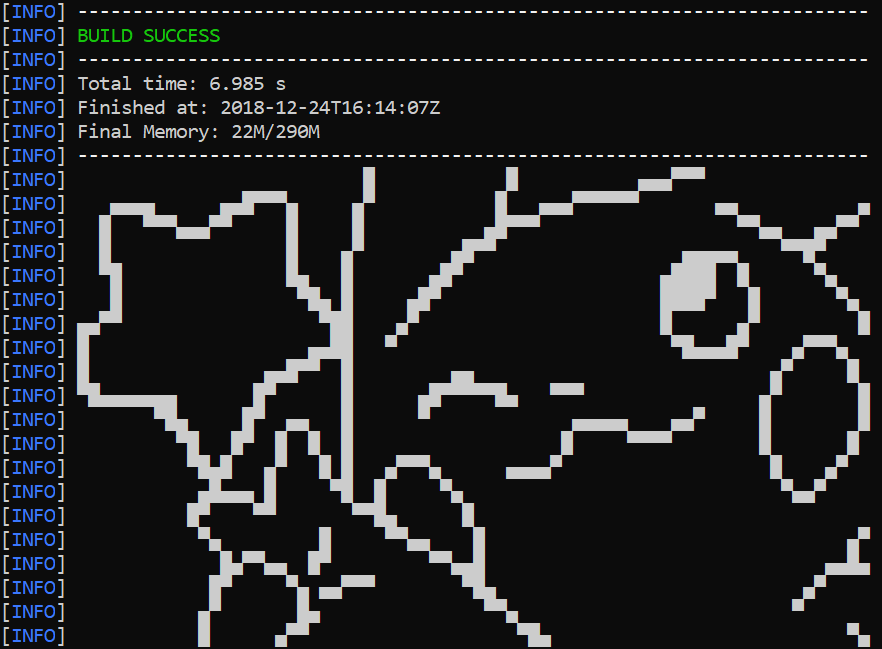

<h1 align="center">Welcome ✌️

# 👀 About Me:
Computer Engineer and Programmer Analyst with experience in web development, cross-platform applications, remote technical support, and report generation using data analysis and artificial intelligence tools. I stand out for my focus on continuous improvement and my commitment to delivering efficient, high-quality solutions.

# 💻 Tech Stack:

# 📊 GitHub Stats:
 
 

---

<!-- Proudly created with GPRM ( https://gprm.itsvg.in ) -->
